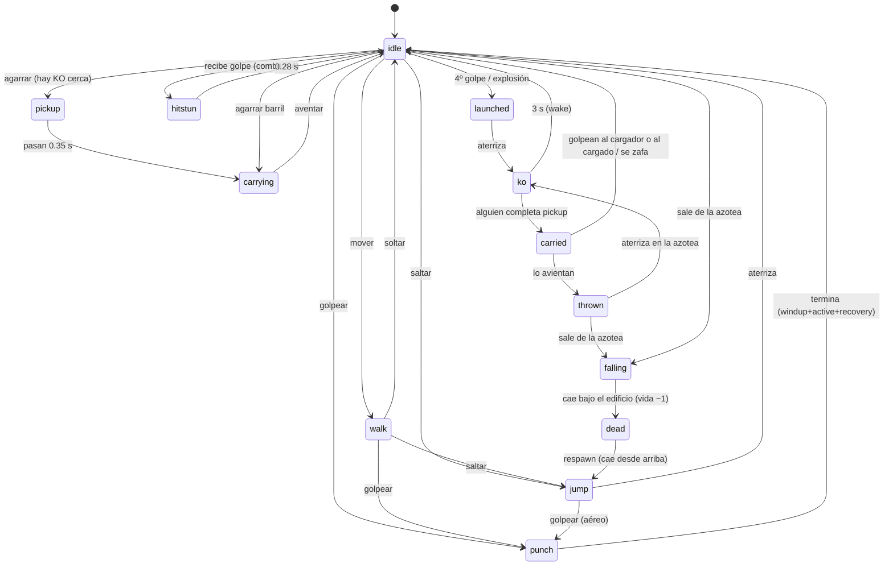
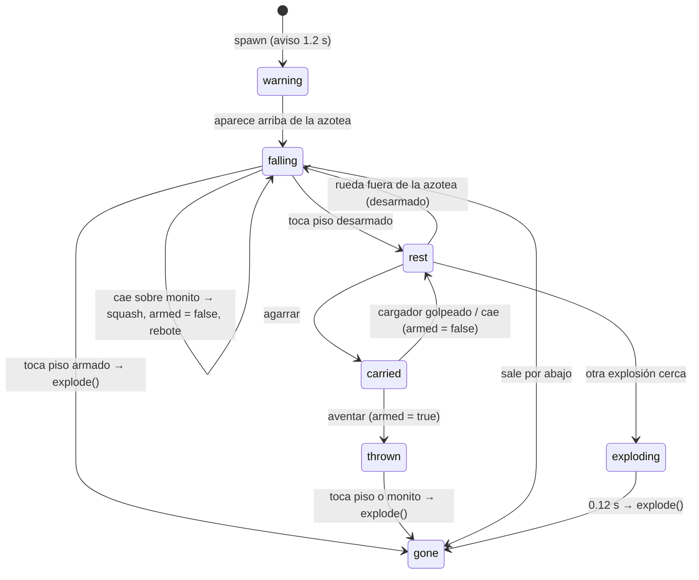

# Lógica del juego

Referencia técnica de cómo están implementadas las reglas en `src/core/world.js`.
Todo lo numérico vive en `src/core/config.js` (`CFG`).

## 1. Modelo

- **Mundo** (`World`): lista de monitos, lista de barriles, azotea (`roof`),
  reloj (`time`), cola de eventos y generador aleatorio inyectable (para pruebas).
- **Monito**: posición `(x, y)` = centro de los pies. Caja de colisión
  `w × h` hacia arriba. `facing` = 1 derecha, −1 izquierda. `state` + `t`
  (segundos dentro del estado). Datos de combo, KO, carga, vidas.
- **Barril**: igual que el monito pero con `armed` (explota al tocar piso),
  `fuse` (cuenta regresiva) y `thrownById`.
- **Input por tick**: `{ left, right, jump, punch, grab }`. `jump/punch/grab`
  son *flancos* (true sólo el frame en que se presionó); el loop del juego se
  encarga de eso.

## 2. Orden del tick (`World.tick(dt, inputs)`)

1. `updateMonito` — máquina de estados y lectura de input de cada monito.
2. `integrate` — gravedad, movimiento, aterrizaje sobre la azotea.
3. `syncCarried` — lo cargado se pega encima del cargador.
4. `resolvePunch` — hitboxes de los golpes activos contra las cajas.
5. `updateBarrels` — avisos, caída, choques, explosiones, cadena.
6. `checkFall` — detectar quién salió de la azotea y quién ya cayó (vida −1).
7. `checkWin` — ¿queda uno solo con vidas?

Se corre a paso fijo de 1/120 s desde `game.js` (acumulador), así la física es
determinista y no depende de los FPS.

## 3. Máquina de estados del monito



Estados "accionables" (aceptan input): `idle`, `walk`, `jump`, `carrying`.
Estados "golpeables": `idle`, `walk`, `jump`, `punch`, `hitstun`, `pickup`,
`carrying`, `carried`. Los demás (`ko`, `launched`, `thrown`, `falling`,
`dead`) ignoran los puñetazos. Pegarle a un KO no hace nada: la forma de
"aprovecharlo" es cargarlo.

## 4. Golpe y combo

```
hitbox = rectángulo frente al monito:
         desde el borde del cuerpo hasta +range (46 px),
         entre 15 % y 85 % de su altura.
activo entre t = windup (0.07 s) y t = windup + active (0.17 s).
Un golpe sólo conecta una vez (punchHit).
```

Al conectar sobre la víctima `v` desde el atacante `a`:

```
if v.state == carried:      cancelar carga de su cargador; fin (v vuelve a idle)
if v.state in (pickup, carrying): cancelar carga de v (el KO que sostenía vuelve a idle)

if v.combo.attackerId == a.id and (time - v.combo.lastAt) <= 1.4:
    v.combo.count += 1
else:
    v.combo = { attackerId: a.id, count: 1 }
v.combo.lastAt = time

if v.combo.count >= 4:
    launch(v, dir, 520, 560)    → estado launched; al aterrizar → ko 3 s
    a.score += 1
else:
    v.vx = dir * 240 ; v.vy = -140 ; v.state = hitstun
```

`dir` = signo de (v.x − a.x), o hacia donde mira el atacante si están encimados.

Decisiones tomadas (ajustables):
- El combo es **por pareja atacante→víctima**. Si dos jugadores le pegan al
  mismo, no suman entre ellos. Cambiar a compartido: quitar la comparación de
  `attackerId` en `applyHit`.
- `hitstun` (0.28 s) es menor que la ventana de combo (1.4 s) para que sea
  posible escapar caminando/saltando entre golpes; el 4.º golpe exige presión.

## 5. Desmayo (KO)

- `enterKO(m, duración)`: pone `koTimer`, frena el cuerpo, reinicia combo.
- Cada tick en `ko`: `koTimer -= dt`; en 0 → `wake` (idle + 0.5 s invulnerable).
- Fuentes de KO: aterrizar tras `launched` (combo o explosión), aterrizar tras
  `thrown`, barril en la cabeza (`squash`).
- Un barril en la cabeza de alguien ya KO **recarga** el reloj a 3 s.

## 6. Cargar / aventar

```
tryGrab(m):
  1) KO más cercano a < 64 px (+ medio ancho) que nadie esté levantando
        → m.state = pickup, m.pickupTargetId = ko.id
  2) si no, barril en `rest` más cercano en ese rango
        → barril.state = carried ; m.state = carrying   (sin windup)

pickup (0.35 s) → completePickup:
  si el objetivo sigue KO: objetivo.state = carried ; m.state = carrying
  si no (despertó / lo levantó otro): m.state = idle

carrying:
  velocidad 150 ; sin salto ni golpe ; el cargado se dibuja sobre la cabeza
  agarrar → throwCarried:
     monito: state = thrown, vx = facing*620 (+ mitad de tu vx), vy = -420,
             koTimer = max(koTimer, 0.8)
     barril: state = thrown, armed = true, mecha visible

cancelCarry(cargador, motivo)  — motivos: hit | squash | explosion | launch
  el cargado: state = idle, koTimer = 0, invuln 0.5 s, se coloca detrás del cargador
  el cargador: si estaba en pickup/carrying pasa a idle
               (quien llamó lo manda después a hitstun/ko/launched según el caso)

breakFree(cargado)  — el koTimer llegó a 0 mientras lo cargaban
  el cargado: idle, invuln 0.5 s, se coloca frente al cargador
  el cargador: hitstun + empujón hacia atrás
```

Casos borde cubiertos por pruebas (`tests/grab.test.js`):
- Dos jugadores intentan levantar al mismo KO → sólo el primero entra en `pickup`.
- El cargador camina fuera del borde → ambos caen y ambos pierden vida.
- Golpear al cargado (desde un salto) cancela igual que golpear al cargador.

## 7. Barriles



`explode(b)`:
1. Emite evento `explode` (render: anillo, humo, tablas, shake, flash).
2. Cancela cargas de todos los que están en radio (150 px del centro).
3. Lanza a todos los monitos en radio (excepto `dead`, `carried`, `falling`)
   con fuerza proporcional a la cercanía (50 %–100 %). Si el barril fue
   aventado por alguien, ese alguien suma KO.
4. Barriles en radio pasan a `exploding` con mecha de 0.12 s (cadena).

Spawn: `nextBarrelIn` empieza en 5 s y después toma valores en [6, 12] s.
`x` aleatorio dentro de la azotea con margen de 60 px.

## 8. Caídas, vidas, victoria

- Un monito **sale** de la azotea cuando `x` está fuera del rango y `y` ya bajó
  24 px por debajo del nivel del piso → `falling` (sin control; si cargaba a
  alguien, ese alguien también pasa a `falling`, un barril cargado cae desarmado).
- A 420 px bajo la azotea → `die`: vidas −1, `dead`, reaparece en 2 s si le
  quedan vidas.
- `respawn`: aparece 320 px arriba del centro (±20 % del ancho), cae con 1.5 s
  de invulnerabilidad.
- `checkWin`: con 2+ jugadores, si queda ≤ 1 con vidas termina la partida.

## 9. Eventos que emite el mundo

| Evento | Datos | Uso en render |
|---|---|---|
| `hit` | attackerId, victimId, x, y, dir, combo / cancelled | estrellas, texto ¡POW!/xN |
| `combo` | attackerId, victimId, count, x, y | "¡COMBO! ¡A VOLAR!", anillo, shake |
| `launch` | id, dir | — |
| `ko` / `wake` | id | polvo, "¿eh?" |
| `pickupStart` / `pickup` / `throw` | id, targetId | — |
| `carryCancelled` | carrierId, targetId, reason | texto ¡CANCELADO! (vía `hit`) |
| `breakFree` | id, carrierId | "¡ME ZAFÉ!" |
| `barrelWarning` / `barrelSpawn` / `barrelLand` | barrelId, x | señal `!`, sombra |
| `barrelPickup` / `barrelThrow` / `barrelDropped` | id, barrelId | — |
| `squash` | id, barrelId, x, y | ¡PLOC! |
| `explode` | barrelId, x, y, radius | explosión completa |
| `land` / `jump` | id, x, y | polvo |
| `fallStart` / `fallOff` / `respawn` | id, stocks | ¡ADIÓS! |
| `matchOver` | winnerId | pantalla final |

El render nunca modifica el mundo; sólo lee y consume eventos. Eso deja la
puerta abierta a repetir partidas (replays) o a correr el mundo en un servidor.

## 10. Bot (`src/bot.js`)

Prioridades, de mayor a menor:
1. Cargando a un monito → caminar al borde más cercano y aventar.
2. Cargando un barril → acercarse al rival y aventarlo a < 260 px.
3. Hay un KO a < 260 px que nadie levanta → ir y agarrar.
4. Hay barril en el piso a < 200 px (y no viene otro cayendo) → ir y agarrar.
5. Viene un barril cayendo a < 90 px → alejarse.
6. Acercarse al rival más cercano; en rango golpear cada 0.35–0.8 s; saltar si
   el rival está arriba. Nunca camina a menos de 40 px del borde salvo que
   esté cargando a alguien.

## 11. Parámetros para "tunear" primero

| Parámetro | Valor | Qué cambia |
|---|---|---|
| `combo.window` | 1.4 s | Qué tan fácil es encadenar 4 |
| `punch.hitstun` | 0.28 s | Tiempo sin control tras un golpe |
| `ko.duration` | 3 s | Ventana para cargar al desmayado |
| `grab.windup` | 0.35 s | Riesgo de que te interrumpan al levantar |
| `monito.carrySpeed` | 150 | Qué tan lejos llegas antes de que despierte |
| `barrel.spawnMin/Max` | 6–12 s | Caos ambiental |
| `barrel.explodeRadius` | 150 | Cuántos se lleva una explosión |
